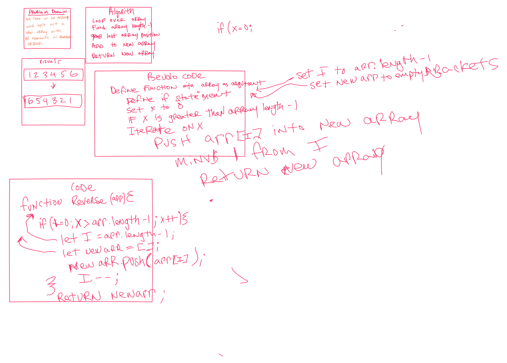

# Array Reverse

## Description
take in an array and output new array with elements in reverse order

## Whiteboard Process

## Solution
Define function with array as argument
Set i to arr.length -1
set new arr to empty array
define if statement
set x to 0
If x is greater than array length -1
Iterate up on x
push arr[i] into new array
decrement 1 from i
when if statement is finished return new array

## Approach & Efficiency 
I took the if then statement approach to iterate through the array and reverse the elements.