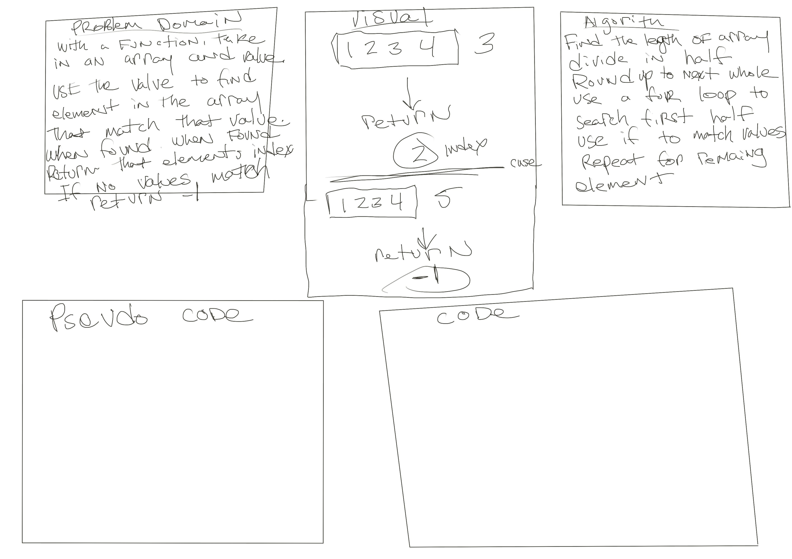

# Array-binary-search

## Description
with a function, take in an array and value. Use the value to find a element in the array that matches that value. When found return that elements index. If no value matches return -1.

## Whiteboard Process

## Solution

## Approach & Efficiency 
 