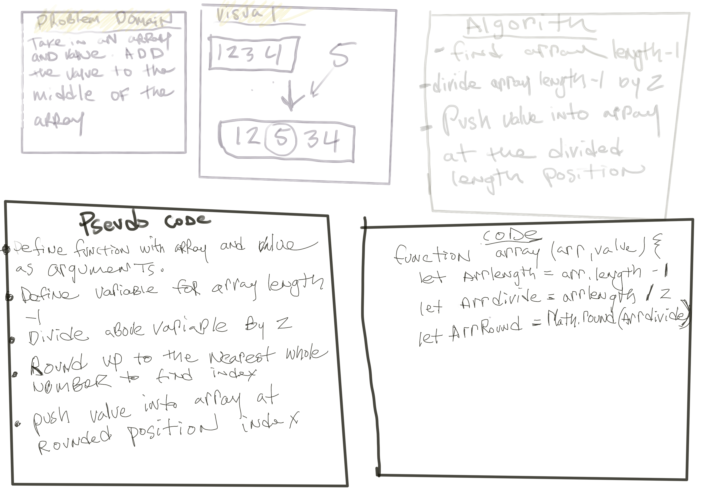

# Array-shift

## Description
take in an array and a value. Add the value to the middle of the array.

## Whiteboard Process

## Solution
find array length -1
divide array length -1 by 2
round up the the nearest whole number
push value into array at the divided length position

## Approach & Efficiency 
I took the for loop approach to iterate through the array and reverse the elements.       